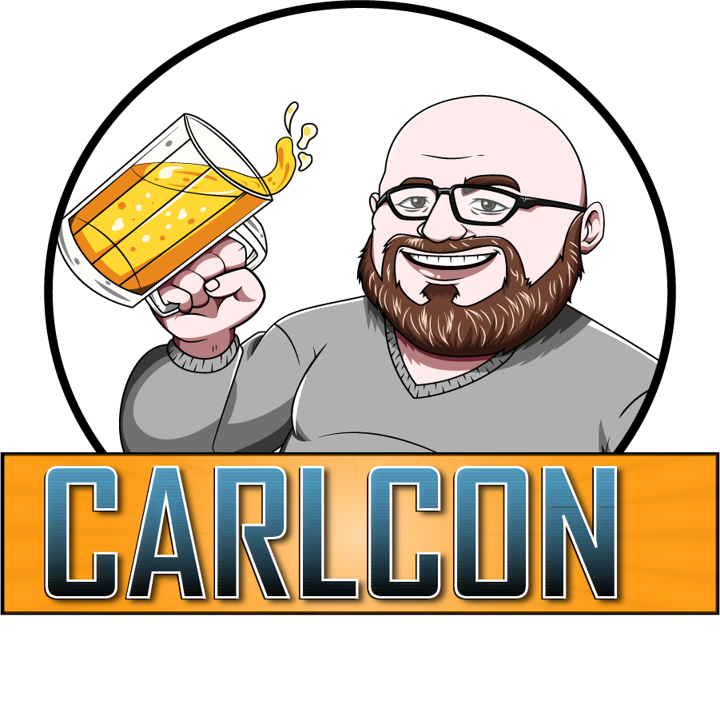

---
# Feel free to add content and custom Front Matter to this file.
# To modify the layout, see https://jekyllrb.com/docs/themes/#overriding-theme-defaults

layout: default
---

### Format:
Carlcon is a Challenger Event and [LVO Invitiational Qualifier](https://www.lvois.com/)

It will be using chess clocks, as outlined in the [LVOIS player packet](https://docs.google.com/document/d/1zrtl06lB93g62fXkPvCvJITXAQHZUDDBRqRKXxkopnk/edit?tab=t.0)
### Date:
September 6th-7th, 2025
### Location:
Great Escape Games

1250 Howe Ave #3A, Sacramento, CA 95825
### Registration:
**SOLD OUT!** Please contact Carl below to be added to the waitlist. 

Email [Carl@carlbaughman.com](mailto:Carl@carlbaughman.com)

Please include the Longshanks number and name of the person you are signing up in the memo
### Players:
Hard cap at 64
### Longshanks:
[https://www.longshanks.org/event/21870/](https://www.longshanks.org/event/21870/)
### Contact:
[carl@carlbaughman.com](mailto:carl@carlbaughman.com)

### 2025 Schedule:
<ins>**Saturday**</ins>

**Registration:** 9:00 AM

**Round One:** 10:00 AM

**Lunch Break:** 12:15 PM

**Round Two:** 1:00 PM

**Round Three:** 3:15 PM

**Round Four:** 5:30 PM

Beer and Pizza at Kong Brewing (after Round Four)

<ins>**Sunday**</ins>

**Check-in:** 9:30 AM

**Round Five:** 10:00 AM

**Lunch Break:** 12:15 PM

**Round Six:** 12:45 PM

**Awards:** 3:00 PM

<!-- [Link to another page](./contact-us.html). -->